<h1 align="center">Full-Stack | Matheus Lima Coutinho</h1>
<h3 align="center">Currently learning Design Patterns and DevOps. | Computer Science Student.

<h3 align="left">Languages and Tools:</h3>

 

  

<h3 align="left">Github Stats:</h3>

  

